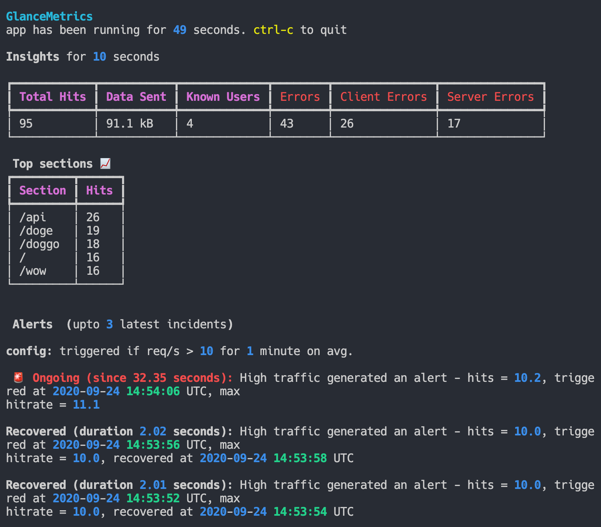

# GlanceMetrics

Hello/Bonjour!, thank you for taking out the time to carefully evaluate this project. If you have any questions/concerns please let me know.

## How to run the app on your machine

We're going to use **docker** so that you do not have to install
anything on your system. Follow these steps:

0. `cd` to this directory (dir with readme.md)
1. Build the image `docker build -t glancemetrics .`
2. To run the app, you'll need to mount the directory of log file, else docker won't be able to see it. For eg. if log file is `/tmp/access.log` then mount `/tmp` dir in docker run command. Here's how  `docker run -it -v /tmp:/data glancemetrics -f /data/access.log` . Your app should be running! 

> Note: UI updates every 2 seconds by default, it'll show the insights for past 10 seconds. I just didn't feel like waiting 10 seconds. Everything is configurable for your needs though.

To get full list of configurable options and help pass `-h` flag: `docker run -it -v /tmp:/data glancemetrics -h`.
  - You can configure file-path, insights-window, alerts-threshold, alert-window, ui-refresh-rate, top-section-limit and more!
  - eg. with file in `/home/akshay/logs.txt`, insights-window of 30s, alert triggering at 20req/s avg for 5mins: `docker run -it -v /home/akshay:/data glancemetrics -f /data/logs.txt --timewindow=30  --alert_threshold=30 --alertwindow=5`

## Running tests

  - `make test`

## Code overview
Here's the breakdown in brief:
- **domain/models**: `LogRecord`, `LogBucket`, `LogSeries` - capture the core-primitives that I felt made it easier to work with the problem i.e Thinking in terms of buckets, series, time-windows, and simple functions operating on them.
- **`watchdogs/log.py`**: streaming log reader that yields buckets of logs
- **domain** - `summary`, `insights`, `alerts`: calculate interesting insights, trigger/recover alerts etc.
- **`glance.py`** - main app library that uses the above constructs and tails the log file.
- **`app.py`** - boots the app with desired configuration options, and keeps it ticking.
- **`ui.py`** - user interface and presentation.
- **tests**: recommend checking out the tests for more insights.

## Bonus: Live demo!

What?? Yep, I'm going to use another project on mine to demo this project!
It's like deploying to production -- satisfying.
I've set-up 2 streaming terminals -- one of this application, and the other with `tail -f` of the log file it's monitoring.

check it out (no sign-in needed): https://teletype.oorja.io/rooms?id=bc41ea1c-bcca-482a-8c1c-14576460e429#MVcLBWDmMqZSmiWcqYyuYQ==

^^ looks better on large screens, keep scrolled to bottom.
I'll keep this running for a week, hopefully, my cheap VPS holds up well during this time.

## Other thoughts, improvements

- I'm pretty content with the overall design and performance of the program.
  - [x] "something you would be proud to put your name on"
- Speaking of performance, I tested it by generating fake logs with `make generate_logs` - req/s averaging `7000/s`. The UI was still fast enough to refresh every 2 seconds.
- When starting afresh with large log files (109 MB) though it could take ~11 seconds for the first render (a lot of wasteful processing for logs we're not interested in). To combat this I seek to end of file at the start of the program, since we're only interested in the recent logs. Now it starts instantly. An improvement could be to seek till the first log which falls within the insights-window and then init the log-stream.
- Improve test-coverage for `glance.py` - enforce-wiring with alerts/insights view eg. `assert alert.ingest.called_with(fake_log_buckted) on glance.refresh()`.
- Writing the alert triggered/recovered to a file would be useful I think.
- Lookout for log-rotation and stream the new log file (maybe monitor metadata?)
- There's no limit to the possible new features though:
  - plot graphs/sparkline on cli
  - different alert-types (the app supports multiple alerts, though only one implemented)
  - http-server with insights-api/websockets updates for a browser-app.
- Misc: Evaluate introducing a MetricSeries data-structure (series of reduced-metrics of log-buckets). I thought of this when implementing hit-rate alert. This would increase efficiency. Though it was good enough to reuse log-series where I have all the information.

That's it, have a great day!